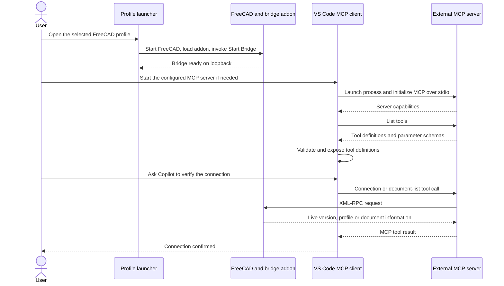
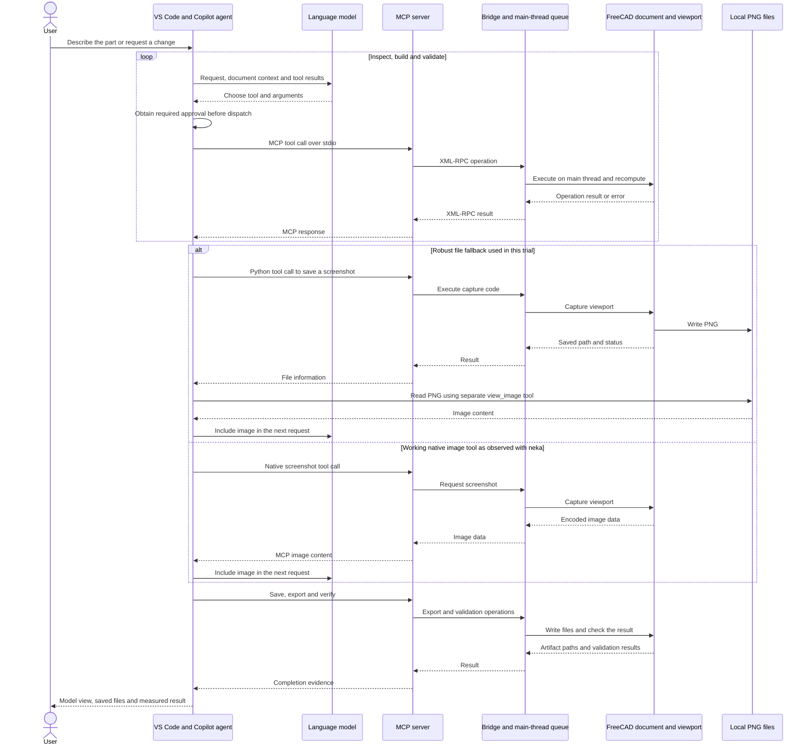

# Architecture and Operating Flows

The [README diagram](README.md#architecture) shows the Robust connection and the file-reading screenshot fallback used in this experiment. Neka uses the same broad split between an external MCP server and an addon inside FreeCAD, but its native screenshot tool returned image content through MCP. The distinction is between the route used to request a capture and the route used to deliver its pixels.

## Components

**VS Code and Copilot** own the conversation and tool dispatch. After the model proposes a call, VS Code checks its availability and applicable approval settings. A call requiring approval waits for the user to review its tool name and arguments; an already approved call can proceed. A rejected call is not sent to the MCP server. These are execution permissions, not CAD validation or a guarantee that arbitrary Python is safe. The [permissions settings](SETUP.md#vs-code-settings) control when confirmation is required; approval does not grant Windows administrator rights.

**The external MCP server** is a Python process launched from the workspace MCP configuration. In this setup it communicates with VS Code using MCP over standard input/output. It exposes tool schemas and translates calls into operations for FreeCAD. The experiment's thin launcher wrapper supplied the candidate-specific environment while forwarding this stream unchanged.

**The bridge addon** runs inside FreeCAD. Robust's external server connects to it through XML-RPC on loopback port 9875. The bridge queues CAD work for FreeCAD's main thread, where GUI and document operations can run in the correct execution context. The same port must be configured on both sides. This XML-RPC connection is separate from the MCP transport used by VS Code.

**FreeCAD** owns the document, feature history, constraints, geometric computation, recomputation and viewport. Its Python APIs expose those operations to the bridge. Documents, STEP/STL exports and saved images are written locally. Whether a screenshot's pixels return through MCP or are read from disk depends on the tool's implementation and the capture path used.

**The profile launcher** starts FreeCAD with the chosen addon, settings and paths. In this experiment, its startup macro selected the workbench and invoked the bridge's Start command. The equivalent manual steps are described in [daily startup](SETUP.md#daily-startup). Keep one candidate active at a time so calls reach the intended FreeCAD instance.

## How Images Reach the Model

**Native screenshot response.** The capture request travels from VS Code through the MCP server and bridge to FreeCAD. The rendered image data returns along the reverse path. Base64 is a way to carry the image bytes in a text-based message; the external server's response format determines how the client receives them. Neka's `get_view` delivered typed MCP image content to the chat. A Base64 string inside ordinary JSON text is a different response format and does not itself establish that the model received a visual input.

**Robust's intended native path.** In the tested release, `get_screenshot` prepares Python that saves a temporary PNG, reads and Base64-encodes it inside FreeCAD, and returns the data through the bridge. The server exposes that result as a dictionary with `success`, `data` and image metadata. Our native call failed before delivering pixels and returned `success: false, data: null`.

**Robust's actual fallback in this experiment.** Copilot called the MCP Python tool to run `saveImage` inside FreeCAD. The command crossed the bridge, but the image was saved to a local PNG. The tool response returned status and file information. Copilot then called the separate `view_image` tool to read that PNG and add image content to the conversation. In this path, the pixels travel from the filesystem through the image-reading tool to the chat and model; they do not pass back through the FreeCAD bridge. The logs record six such image reads across the initial and revision phases.

## Installation Flow

1. The user sends the [installation prompt](SETUP.md#install-through-copilot) in Agent mode.
2. Copilot uses VS Code's existing web, file and terminal tools to inspect FreeCAD, read the project's installation instructions and prepare a compatible environment.
3. It installs the external MCP dependencies, places the addon in a dedicated FreeCAD profile, creates the profile launcher and registers the workspace MCP entry.
4. The user completes any required trust or UI actions. Copilot verifies the advertised tool schemas and an actual call from the chat to FreeCAD.
5. An installation record lists the versions, paths and owned files for subsequent startup and removal.

This setup flow uses VS Code's built-in tools before the FreeCAD MCP is available. Once the connection is verified, drawing uses the selected MCP tools.

## Startup Flow

Opening a normal FreeCAD shortcut may load a different profile. Use the generated launcher when the addon lives in an isolated profile. With manual startup, select the appropriate workbench and start its bridge before checking the connection in Copilot. The addon can also be configured to auto-start. FreeCAD remains open for the rest of the drawing session.

## Modeling and Revision Flow

A dedicated tool might create a sketch, pocket a profile or export a solid. For operations that the server does not expose directly, Copilot can use its Python execution tool; the code still travels through MCP and the bridge into FreeCAD. The experiment recorded this separately because it places more of the implementation work on the model.

Errors and measurements feed the next iteration. A returned success flag alone does not establish that a part is correct: dimensions, solid validity, constraints, clearances and reopened exports provide the evidence. That feedback loop caught the open STL mesh in the Robust trial and the arc-constraint problem during the neka revision.

A revision continues in the same FreeCAD document. Copilot changes the named parameters, FreeCAD recomputes dependent features, and the validation is repeated. Initial exports can be preserved alongside the revised files, making the change inspectable.

## Autopilot and Approvals

Autopilot changes how the agent continues and handles approvals; it does not change either transport in these diagrams or replace the bridge startup step. Default / Manual permissions supports the same MCP workflow with user confirmations. Autopilot can continue, retry and answer blocking questions automatically, with broader tool permissions. Use the setting intentionally and keep access scoped to the task. Details and UI differences are in [VS Code settings](SETUP.md#vs-code-settings).

## Removal Flow

1. Send the [removal planning prompt](SETUP.md#uninstall-through-copilot). Copilot reads the installation record and identifies candidate-owned files, processes and settings.
2. Review the dry run and save any open models. Confirm the exact removal scope.
3. Stop that MCP in VS Code and close only its owned FreeCAD instance when safe. Remove the matching entry, addon/profile, environment and launcher according to the approved plan.
4. Check that the removed server has no remaining process or listener and that the retained server and model files remain usable.

Unused candidates may instead stay installed and disabled. Our continued drawing setup selects Robust only; the other environments can be removed later to reclaim space.
