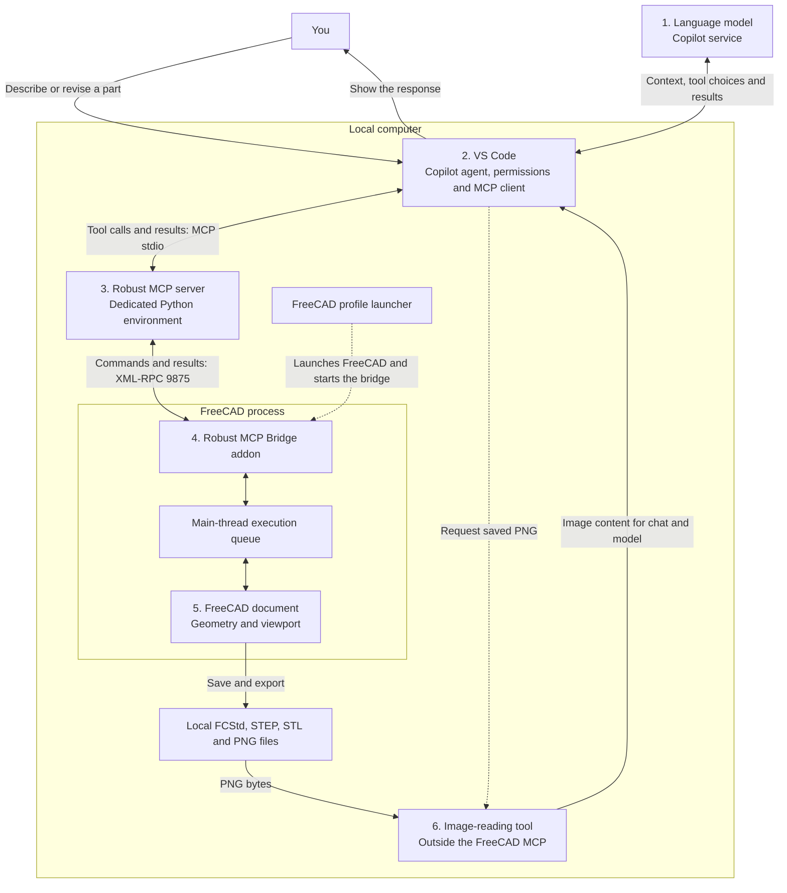

# Drawing in FreeCAD with GitHub Copilot

Can GitHub Copilot create a FreeCAD model from chat, then revise it without rebuilding it? We compared three community Model Context Protocol (MCP) servers, from installation to modeling and a dimensional revision.

Two completed the task with editable models and validated CAD exports. **Robust** finished sooner and handled the dimensional change without constraint repairs; **neka** used fewer tokens and delivered images directly to chat. Promising results, but one paired run is not a definitive ranking.

## The Three Servers

Each server gives Copilot tools to inspect and edit FreeCAD documents, using dedicated CAD operations or Python execution inside FreeCAD.

| Project | Tested version | Outcome in Copilot |
| --- | --- | --- |
| [neka-nat/freecad-mcp](https://github.com/neka-nat/freecad-mcp) | 0.1.25 | Completed construction and revision; three sketches needed constraint repairs during the revision |
| [blwfish/freecad-mcp](https://github.com/blwfish/freecad-mcp) | 8.2.2 | Passed the preliminary technical tests; Copilot rejected a tool schema when starting the chat trial |
| [spkane/freecad-addon-robust-mcp-server](https://github.com/spkane/freecad-addon-robust-mcp-server) | 0.6.2 | Completed construction and revision; the dimensional change propagated through the existing model |

## Architecture

The Robust connection, including the screenshot fallback used in this trial:

Copilot chooses tools from your request and previous results; VS Code applies its approval settings. Approved calls travel through the MCP server to the bridge, which queues execution on FreeCAD's main thread. FreeCAD solves constraints, recomputes geometry and writes the requested files; measurements and errors return along the same path. **Permission to run a tool is not a guarantee of correct geometry or safe Python.**

Images took different routes: neka returned them as native MCP image responses. In the Robust trial, Copilot saved a viewport PNG through the bridge, then read its pixels with a separate `view_image` tool outside the FreeCAD MCP. See [architecture and operating flows](ARCHITECTURE.md) for both paths.

## Installation Through Chat

We could have researched the servers, installed packages and configured profiles by hand. Perfectly doable; not how we wanted to spend the afternoon. In *Back to the Future Part II*, the kids dismiss an arcade game:

> "You mean you have to use your hands? That's like a baby's toy!"

An afternoon of manual package installation probably would not have impressed them either. So we gave the repetitive work to Copilot: detect FreeCAD, install and check the candidates in isolated environments, and prepare a profile launcher with removal planned from the start. We still reviewed the setup and enabled the selected server in VS Code.

To reproduce this, use the [installation prompt and VS Code settings](SETUP.md#install-through-copilot); the [removal prompt](SETUP.md#uninstall-through-copilot) preserves your models and FreeCAD installation. Normal Agent approvals are sufficient. Autopilot is optional and allows automatic continuation with broader permissions.

For drawing, **both the FreeCAD bridge and VS Code's external MCP server must be running**. Our launcher starts the selected profile and bridge; a manual launch needs **Start Bridge** (Robust) or **Start RPC Server** (neka). Start the external server through **MCP: List Servers**, enable its tools and ask Copilot to list open documents. Keep FreeCAD open. [Daily startup and troubleshooting](SETUP.md#daily-startup) covers workbench selection and profile-specific auto-start settings.

## The Design Task

We used FreeCAD 1.1.3 x64 on Windows ARM64, isolated candidate profiles, the same Copilot model with high reasoning, and one MCP active at a time.

After simple plate, box and flange checks, the main task was a **120 x 80 x 40 mm electronics enclosure**: 3 mm walls, rounded corners, four screw posts, blind pilot holes and a cable opening. Its lid had clearance holes, counterbores, ventilation slots and a locating lip with 0.4 mm clearance.

After saving, a second prompt changed length to **140 mm** and height to **50 mm** through the existing parameters. Posts, holes, lid and lip had to follow while wall thickness and fit stayed unchanged.

| Revised model through neka | Revised model through Robust |
| --- | --- |
|  |  |

Both final models passed checks for dimensions, valid solids, sketch constraints, assembled-part interference and reopened files. FCStd history remained editable; final STEP and STL exports passed validation.

## Results

Times cover discovery through the final response, including retries, validation and exports, but exclude the pause between prompts. Tokens come from chat logs; cached input is part of total input.

| Measurement | neka | Robust |
| --- | ---: | ---: |
| Initial construction | 17 min 32 s | 13 min 42 s |
| Parametric revision | 7 min 13 s | 4 min 51 s |
| Combined time | 24 min 45 s | 18 min 34 s |
| MCP calls | 56 | 58 |
| Python calls through MCP | 40 | 31 |
| Uncached input tokens | 202,976 | 231,058 |
| Cached input tokens | 5,778,051 | 6,435,268 |
| Output tokens | 42,183 | 48,263 |

Robust finished about **25% sooner**; neka used **12% fewer uncached input tokens** and **13% fewer output tokens**. [Aggregate measurements](data/results.json) contain exact phase values and source revisions. Most time was spent in model requests, not CAD execution. Cache reuse, approval waits and an automatically attached README in both chats limit the comparison; repeatability, independent visual ratings and monetary cost remain unmeasured.

## What Made a Difference

The revision was decisive for our next step: neka's three rounded profiles needed repairs after their arcs switched to an unintended solution. Robust kept its objects and expression links intact as the dimensions changed. **We chose Robust for continued iterative design**, provisionally.

That did not make every Robust tool reliable. Screenshots and some modeling/export operations needed Python fallbacks through MCP. A native STL export reported success but produced an open mesh; validation caught it and Copilot regenerated a closed one. **Check the geometry and files, not just the tool's success message.**

Blwfish never reached modeling in chat: Copilot rejected an array parameter without an `items` schema, despite successful protocol-level checks. A working MCP connection alone does not establish client compatibility.
