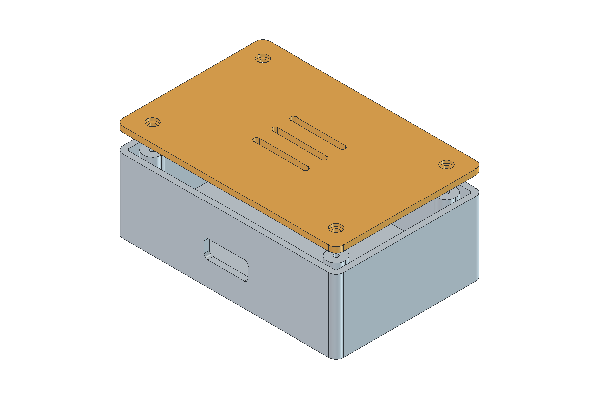
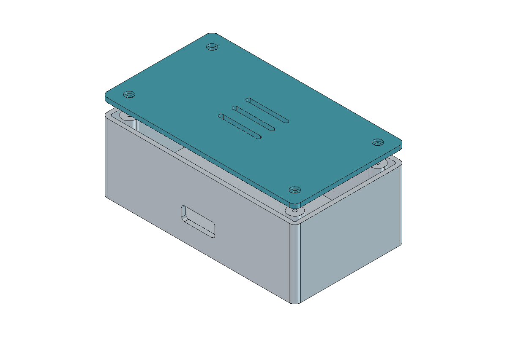
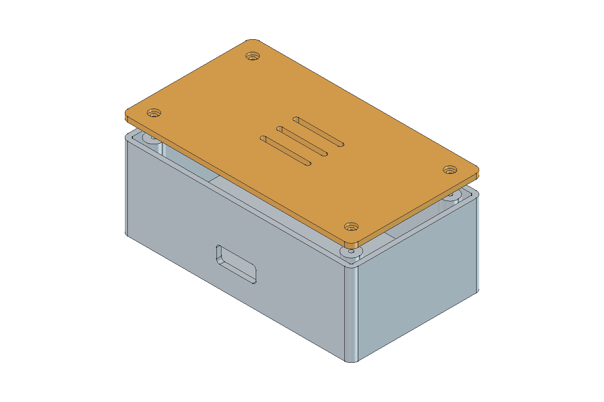

# Drawing in FreeCAD with GitHub Copilot

The aim of this experiment was to compare Model Context Protocol (MCP) servers for creating and editing FreeCAD models from GitHub Copilot chat. There are many community projects connecting AI assistants to CAD software. We tried three, covering installation, modeling and a dimensional revision.

The results are promising. Two servers completed the full design task, producing editable models and usable CAD exports. They took different routes: one used fewer tokens and delivered images directly to the chat; the other produced a model that handled the later dimensional change more smoothly.

## The Three Servers

MCP gives Copilot tools it can call to inspect a FreeCAD document, create geometry, change properties and obtain a view of the result. Each project exposes a different set of operations. Some steps use dedicated CAD tools; others use a tool that executes Python inside FreeCAD.

| Project | Tested version | Outcome in Copilot |
| --- | --- | --- |
| [neka-nat/freecad-mcp](https://github.com/neka-nat/freecad-mcp) | 0.1.25 | Completed construction and revision; three sketches needed constraint repairs during the revision |
| [blwfish/freecad-mcp](https://github.com/blwfish/freecad-mcp) | 8.2.2 | Passed the preliminary technical tests; Copilot rejected a tool schema when starting the chat trial |
| [spkane/freecad-addon-robust-mcp-server](https://github.com/spkane/freecad-addon-robust-mcp-server) | 0.6.2 | Completed construction and revision; the dimensional change propagated through the existing model |

## Installation Through Chat

The setup began with a request to Copilot: find the installed FreeCAD version, research the available MCP servers, install the selected candidates in separate environments, and make them easy to remove after the comparison.

Copilot handled the package installation, configuration and checks. It also prepared a selector that starts the appropriate FreeCAD profile. The user's part was to review the setup and enable the selected server in VS Code. Asking for this in chat turned the installation procedure into part of the same workflow used to draw the model.

Back to the Future Part II comes to mind:

> "You mean you have to use your hands? That's like a baby's toy!"

## The Design Task

The experiment ran on FreeCAD 1.1.3 x64 on Windows ARM64. Each candidate had its own installation and FreeCAD profile. The chat trials used the same Copilot model and high reasoning setting, with one MCP active at a time.

Simple plates, boxes and flanges established the initial connection and export checks. The main task was a more demanding electronics enclosure: a 120 x 80 x 40 mm base with 3 mm walls, rounded corners, four screw posts, blind pilot holes and a cable opening. Its separate lid included clearance holes, counterbores, ventilation slots and an underside locating lip with 0.4 mm clearance.

After the first model was saved, a second prompt increased its length to 140 mm and its height to 50 mm. The existing parameters had to move the posts and holes, resize the lid and lip, and preserve the wall thickness and fit.

| Revised model through neka | Revised model through Robust |
| --- | --- |
|  |  |

Validation covered dimensions, solid validity, sketch constraints, interference between the assembled parts, and reopening the saved files. Both final models satisfied the geometric checks. Their FCStd documents retained editable history, and the final STEP and STL exports passed the recorded checks.

## Results

The table combines initial construction and revision. Time includes discovery, modeling, retries, validation, exports and the final response. The pause between the two user prompts is excluded. Token counts come from the completed chat logs; cached input is included within total input.

| Measurement | neka | Robust |
| --- | ---: | ---: |
| Initial construction | 17 min 32 s | 13 min 42 s |
| Parametric revision | 7 min 13 s | 4 min 51 s |
| Combined time | 24 min 45 s | 18 min 34 s |
| MCP calls | 56 | 58 |
| Python calls through MCP | 40 | 31 |
| Uncached input tokens | 202,976 | 231,058 |
| Cached input tokens | 5,778,051 | 6,435,268 |
| Output tokens | 42,183 | 48,263 |

Robust finished about 25% sooner in this run, while neka used about 12% fewer uncached input tokens and 13% fewer output tokens than Robust. The [aggregate measurements](data/results.json) include the exact per-phase values and tested source revisions.

These figures describe one paired run with both model reasoning and CAD execution included. Most elapsed time was spent in model requests. Both chats also received an automatically attached README, a useful detail to control when repeating the experiment. Cache reuse and approval waits are part of the operating conditions behind the observed times and token counts.

## What Made a Difference

The dimensional revision revealed the clearest difference. In the neka model, three rounded profiles switched to an unintended arc solution when the dimensions changed. Copilot repaired their constraints and completed the revision. The model created through Robust kept its existing objects and expression links while the two dimensions changed. For iterative design, that behavior makes Robust the provisional choice from this experiment.

Neka delivered native MCP images directly to the chat. Robust's screenshot and some modeling/export tools required Python fallbacks through the same MCP. One native STL export even reported success while producing an open mesh; the validation caught it, and Copilot regenerated a closed mesh. Checking the resulting geometry and exported files was essential to reaching a usable result.

Blwfish stopped earlier, at Copilot's tool validation. A spreadsheet parameter was declared as an array without an `items` definition, which the client required. This explains the difference between a successful protocol-level check and a successful start inside Copilot.
